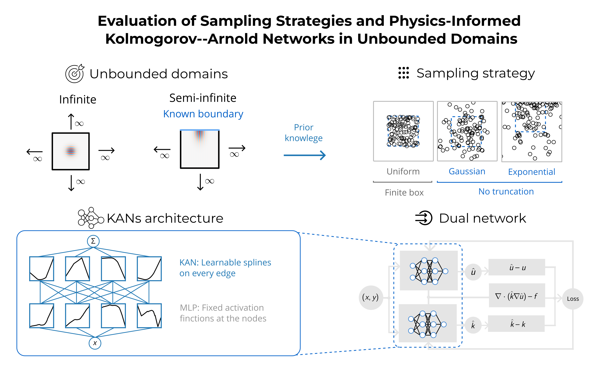

# Evaluation of Sampling Strategies and Physics-Informed Kolmogorov-Arnold Networks in Unbounded Domains

Physics-informed neural networks (PINNs) and Kolmogorov-Arnold networks (KANs) for inverse PDE problems on infinite and semi-infinite domains.



## Overview

This repository studies the recovery of a spatially varying coefficient from sparse observations and PDE residuals. It includes:

- Manufactured solutions and analytical reference fields.
- Uniform, Gaussian, and Gaussian-exponential sampling strategies.
- MLP and KAN models for infinite and semi-infinite domains.
- Hyperparameter optimization with Optuna.
- Accuracy, parameter-count, FLOP, and sampling-efficiency analyses.
- Reproducible training histories, checkpoints, metrics, and figures.

The main implementation is in [`utils/`](utils/). Experiments and visualizations are organized in [`main/`](main/), while publication figures are collected in [`figures/`](figures/).

## Installation

The environment file pins the Python and package versions used by the project, including CUDA 12.8 PyTorch wheels.

```bash
conda env create -f PIKAN-unbounded-domains.yml
conda activate PIKAN-unbounded-domains-env
```

For GPU runs, make sure the NVIDIA driver supports CUDA 12.8 or a compatible runtime. Check the detected driver/runtime with:

```bash
nvidia-smi
```

Verify the PyTorch installation with:

```bash
python -c "import torch; print(torch.__version__, torch.version.cuda, torch.cuda.is_available()); print(torch.cuda.get_device_name(0) if torch.cuda.is_available() else 'CPU')"
```

For CPU-only use, remove the CUDA-specific PyTorch packages from the environment specification and install a CPU-compatible PyTorch build.

## Repository Layout

```text
utils/                         Shared PDE, PINN, KAN, training, and plotting code
main/01_manufactured_solution  Manufactured solutions and analytical plots
main/02_hyperparameter_tunning Optuna studies and hyperparameter plots
main/03_individual_prediction  Individual trained-model predictions
main/04_sampling_approximation Sampling and approximation experiments
main/05_kan_accuracy_efficiency Model accuracy and efficiency comparisons
figures/                       Graphical abstract and publication figures
```

## Methodology

The workflow is summarized in the [graphical abstract](figures/graphical_abstract.svg) and the [methodology schematic](figures/schematic_methodology.svg):

1. Define analytical solutions and variable coefficients on the target domain.
2. Generate sparse observations and PDE collocation points using the selected sampling strategy.
3. Train MLP or KAN models with observation and PDE losses.
4. Evaluate errors inside and outside the training region.
5. Compare accuracy, computational cost, and extrapolation behavior.

## Citation

If this repository supports your work, please cite the associated paper: https://arxiv.org/abs/2512.12074.